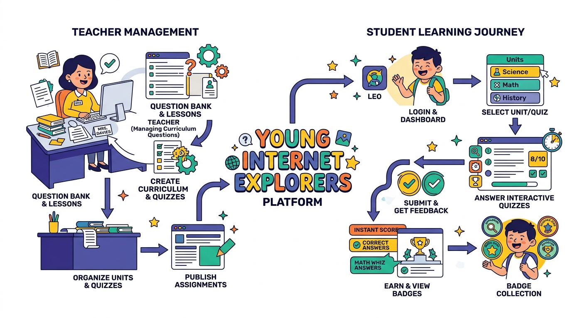

# Master Design Specification & Prompt Blueprint
## Young Internet Explorers Classroom Portal

Welcome to the comprehensive system design and step-by-step implementation guide for **Young Internet Explorers**. This document serves as the absolute blueprint for architectural engineering, UI/UX aesthetics, local state persistence, and dynamic curriculum management, complete with a step-by-step master reconstruction prompt.

---

## 🗺️ System Conceptual Architecture

Our application is built entirely as a responsive single-page full-stack or client-side application utilizing **React (TypeScript)**, **Vite**, and **Tailwind CSS**. It serves two primary personas in a highly integrated classroom layout:
1. **The Student Persona**: Undertakes random, interactive quizzes from the curriculum set, visualizing dynamic network routing graphics, receiving concept coaching hints, and exporting their results as a fully formatted PDF report card.
2. **The Teacher Persona**: Manages the questions database (CRUD operations) live from the portal, evaluates class-wide metrics (average, highest, percentage distribution), and reviews individual student grade ledgers.

Here is the high-level architecture diagram depicting student session tracking and teacher question/result management workflows:



---

## 🎨 Visual Identity & Neobrutalist Vibe
The visual aesthetic diverges from typical generic SaaS templates by utilizing high-identity **Neobrutalism Design Guidelines**:
- **Borders & Outlines**: Hard, thick dark borders (`border-4 border-indigo-950` or `border-2 border-slate-900`).
- **Color Palette**: High-contrast pairings. Core background of off-white (`bg-slate-50`), headers built in vibrant solid indigo (`bg-indigo-600`), warning/instructional text cards in sunny yellow (`bg-yellow-400` or `bg-yellow-105`), and badge cues in bright emerald (`bg-emerald-400`).
- **Shadows**: Rigid solid drop-shadows rather than blurry box-shadows (`shadow-[4px_4px_0px_0px_rgba(0,0,0,1)]` or `shadow-[6px_6px_0px_0px_rgba(79,70,229,1)]`).
- **Typography**: Inter / Space Grotesk sans-serif headings styled in ultra-heavy weights (`font-black tracking-tight uppercase`), coupled with technical data or state indicators rendered using monospaced layout elements (`font-mono text-xs`).

For additional details on styling patterns and CSS blueprints, check out the [Aesthetic & Styling Guide](AESTHETIC_RESOURCES.md).

---

## 📋 Data Schemas & State Blueprints

All state persists within `localStorage` for responsive local database durability:

### 1. Curriculum Question (`Question`)
```typescript
interface Question {
  id: string | number;
  text: string;
  options: string[]; // 4 core string options
  correctOption: 'A' | 'B' | 'C' | 'D';
  graphicKeyword?: string; // keywords: 'web', 'safety', 'network', 'email', 'search', 'hardware'
  helpInstruction?: string; // coaching helper hints
  explanation: string; // explanation exposed on reports
}
```

### 2. Student Session Registry (`StudentInfo`)
```typescript
interface StudentInfo {
  name: string;
  className: string;
  section: string;
  rollNumber: string;
}
```

### 3. Quiz Report Log (`QuizSubmission`)
```typescript
interface QuizSubmission {
  student: StudentInfo;
  answers: Record<string | number, 'A' | 'B' | 'C' | 'D'>;
  score: number;
  totalQuestions: number;
  timestamp: string;
}
```

Pour deeper into schemas and formulation guides under the [Syllabus & Question Design Guide](SYLLABUS_GUIDE.md).

---

## 🚀 Step-by-Step Implementation Prompt
*Copy and paste the master prompt below into any AI coding assistant or use it to reconstruct this application from scratch.*

```markdown
You are a highly experienced React and TypeScript software architect. Your goal is to build the "Young Internet Explorers Classroom Portal" — an interactive student testing and teacher assessment system. It uses a high-contrast Neobrutalist design theme, fully local state persistence, and beautiful micro-animations using frame transitions.

### 1. FONT AND THEME INITIALIZATION
- Import high-contrast visual typography fonts in the CSS header: "Inter" and "Space Grotesk".
- In the global CSS configuration (`@import "tailwindcss";`), define custom font variables:
  - `--font-sans` maps to "Inter"
  - `--font-mono` maps to "JetBrains Mono" or custom monospaced system fallbacks.
- Implement CSS classes to support the Neobrutalist design: chunky, solid offsets (`shadow-[4px_4px_0px_0px_rgba(0,0,0,1)]`), pure black borders, rotated accent panels (`rotate-[-1deg]`), and a striking yellow-and-indigo palette.

### 2. GLOBAL SYSTEM SCHEMAS (`src/types.ts`)
Declare three core interfaces:
1. `Question`: Includes `id` (string/number), `text`, four `options` array, `correctOption` ('A'|'B'|'C'|'D'), `graphicKeyword` (optional metadata determining active interactive svg), `helpInstruction` (student hint text), and `explanation` explanation string.
2. `StudentInfo`: Captures `name`, prefilled `className`, input fields `section` and `rollNumber`.
3. `QuizSubmission`: Captures student details, an action answers record map, final score, total questions count, and precise submission timestamp.

### 3. DYNAMIC CONFIGURATION SCHEMAS (`public/app-config.json`)
The application must customize its look and metadata based on a static configuration file. Create a file structure mapping:
- `appName`: "Young Internet Explorers"
- `className`: "Class 8"
- `unitName`: "Unit 3"
- `subject`: "Computer Science"
- `quizTitle`: "Internet & Its Use"
- `teacherPassword`: "T3ach3r_QuizBot_2026!"

Ensure this JSON is imported directly or queried, mapping metadata parameters seamlessly onto headers, cards, and PDF exam reports.

### 4. CORE CONTROLLING ENGINE (`src/App.tsx`)
- Maintain structural state elements:
  - `isAdminView` (boolean) -> Toggles between student testing ground and administrative dashboard.
  - `isTeacherAuthenticated` (boolean) -> Secures access to the Teacher Desk.
  - `questions` (list of Questions) -> Initialized from a hardcoded syllabus list of 10 high-quality internet safety questions (see standard syllabus documentation) and backed by `localStorage` (key: `qb_questions_list`).
  - `activeQuizQuestions` -> List of exactly 10 questions picked at random, shuffled on a per-student signup action to guarantee exam integrity.
  - `submissions` -> Track records of students, synchronized into local database (key: `qb_submissions_default`).
- Expose CRUD handling dispatchers for editing questions: `handleAddQuestion`, `handleEditQuestion`, `handleDeleteQuestion`, and `handleResetQuestions` (reverting user edits to the default syllabus set).

### 5. NAVIGATION HEADER (`src/components/Header.tsx`)
- Standard sticky toolbar styled in deep indigo (`bg-indigo-600`) with a bold black bottom border (`border-b-4 border-indigo-800`).
- Display dynamic values parsed from `appConfig`: App Title, Class details, and Active Unit indicators.
- Provide a clean Neobrutalist right-aligned action button to toggle between "Student Desk" and "Teacher Portal View".

### 6. STUDENT ENTRY FORM (`src/components/HeroSection.tsx`)
- Features a massive bold hero text banner: "{appConfig.quizTitle} for {appConfig.appName}".
- Presents a crisp Neobrutalist sign-up form card for students. Includes:
  - Name Input (validated non-empty)
  - Class level (automatically prefilled from static configuration)
  - Section Input (text, clean visual outline)
  - Roll Number (validated text, mono font)
- Action Button: Centered "Unlock Cyber Badge & Start Quiz!" button featuring micro hover animations and transition layouts.

### 7. INTERACTIVE TESTING CABIN (`src/components/QuizContainer.tsx`)
This is the active testing ground. On signup:
- Take the selected randomized cohort of 10 questions and lead the student screen-by-screen.
- **Progress indicator**: Left rail depicting a vertical node graph mapping question states (unvisited, current, answered).
- **Interactive Visual Graphics**: Embed a dynamic React Graphic element representing visual packets routing, secure SSL lock animation, or browser crawlers relative to the question metadata keyword (`graphicKeyword`).
- **Coaching Assist Card**: A toggleable visual badge "Reveal Digital Concept Guide" which renders the question's custom coaching hint (`helpInstruction`) next to a decorative lightbulb icon.
- **Neobrutalist Choice Quadrant**: Display choices A, B, C, D in structured responsive buttons. Selected choice receives a vivid yellow background. Include an uppercase indicator: "[A]", "[B]", etc.
- Action Buttons: "Previous" and "Next/Submit" buttons styled with rigid black shadows.

### 8. EXAM GRADING & PDF EXPORTER (`src/components/ResultSummary.tsx`)
- Display overall marks with cheerful completion badges.
- **Score breakdown**: Visual progress gauges showing percentage accuracy.
- **Result Log Ledger**: Scrollable roster reviewing each question, selected answer, and correct response, accompanied by the customized interactive explanation.
- **Report Card Downloader**: Render an "Export PDF Report Card" action button. Using `jspdf`, generate a highly polished corporate PDF containing:
  - Custom geometric header grids
  - Student Profile Card blocks formatted in double-outline borders
  - Clean tabular list detailing answers, actual scores, final grade percentages, and certified submission timestamps.

### 9. PRINCIPAL DESK & TEACHER DASHBOARD (`src/components/TeacherPortal.tsx`)
Accessible under the teacher views toggle with password verification (`TeacherLogin.tsx`):
- **Overview Analytics**: Render 4 primary Neobrutalist statistics cards showing total participants, class-wide average score, highest recorded mark, and active syllabus size.
- **Submissions Ledger (Sub-Tab)**: Fully searchable list of all student submissions, featuring filter dropdowns for specific school sections. Render clear grading tags (A+, B-, etc.) based on scores. Expose a "Delete All Grades" option with security confirmation.
- **Syllabus Editor (Sub-Tab)**: Displays the active testing database. Expose complete CRUD management:
  - Editing individual questions via a comprehensive slide-out or overlay form (editing questions text, option descriptions, correct letter, and explanation).
  - Deleting customized questions.
  - Adding new curriculum questions to local cache list.
  - "Reset Default Syllabus" action button to instantly revert local questions to standard safe configurations.
```

---

## 🔗 Supplementary Guides
- Explore custom styles, layouts, and animations inside [Aesthetics & Neobrutalism Design Guide](AESTHETIC_RESOURCES.md).
- Dive deep into syllabus composition, default questions, and pedagogy mapping under [Syllabus & Question Formulation Guide](SYLLABUS_GUIDE.md).
